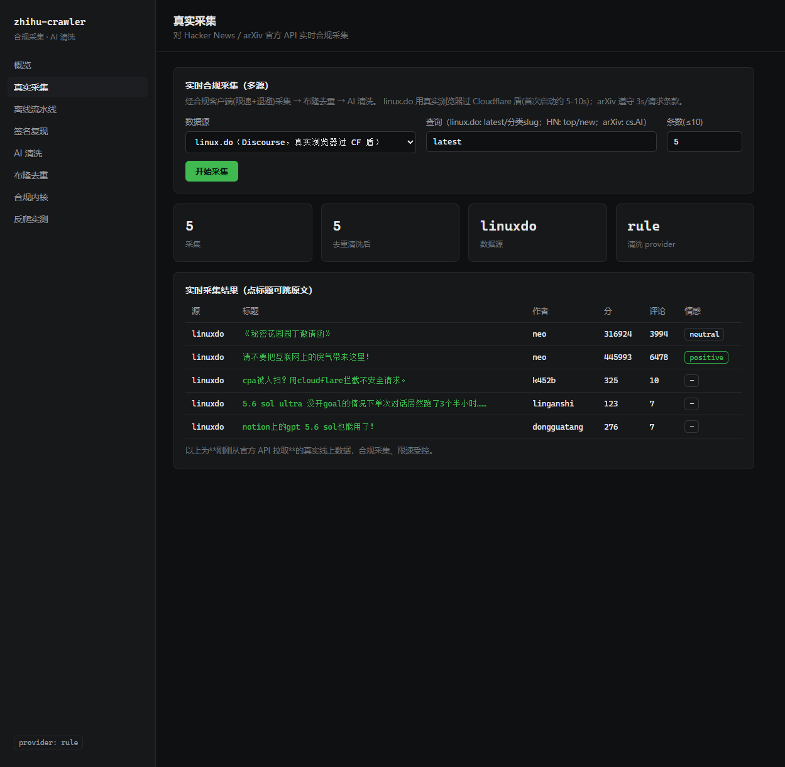
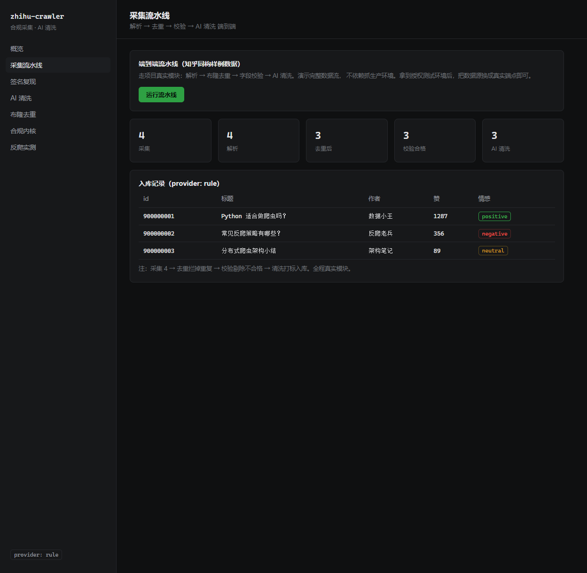
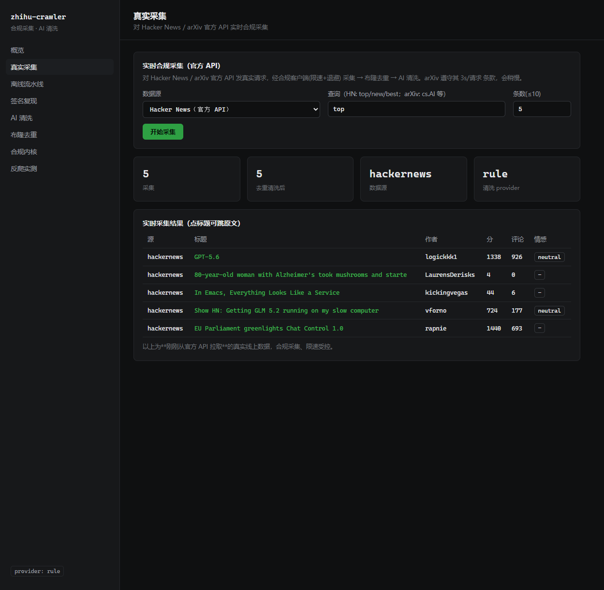
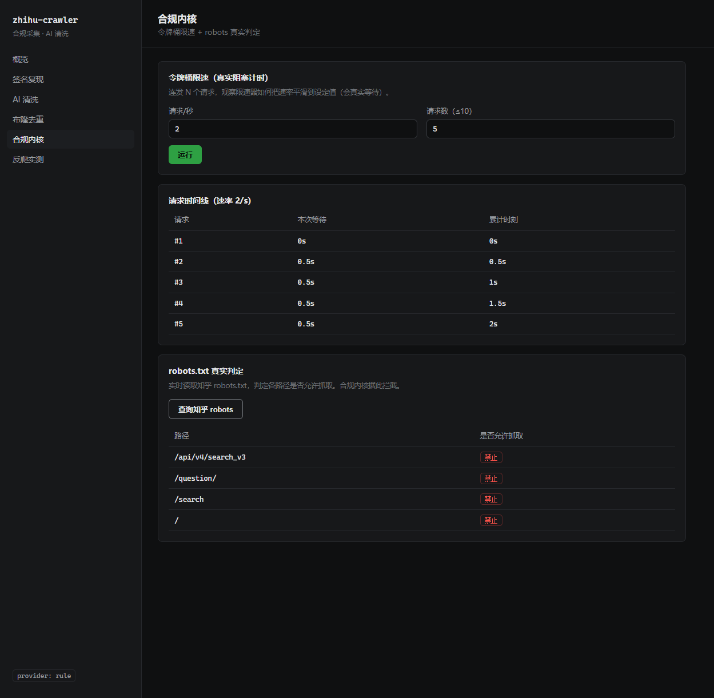
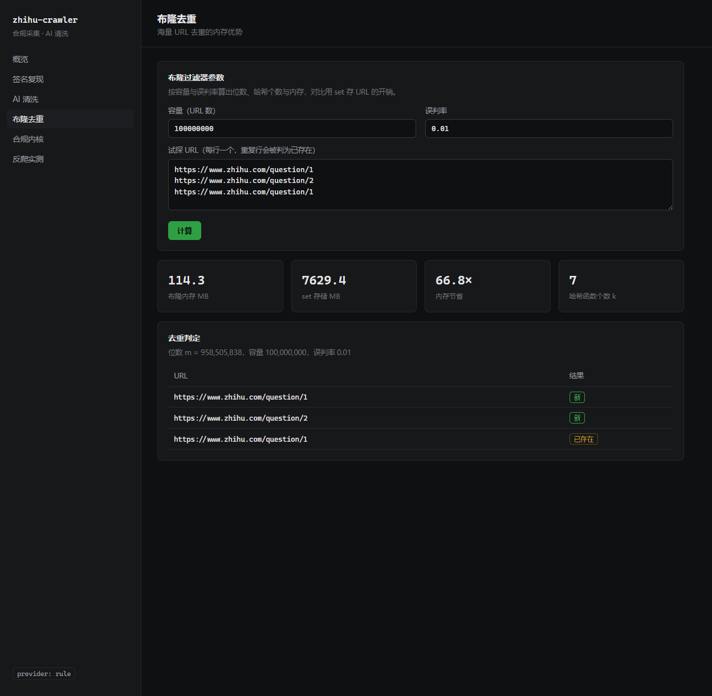
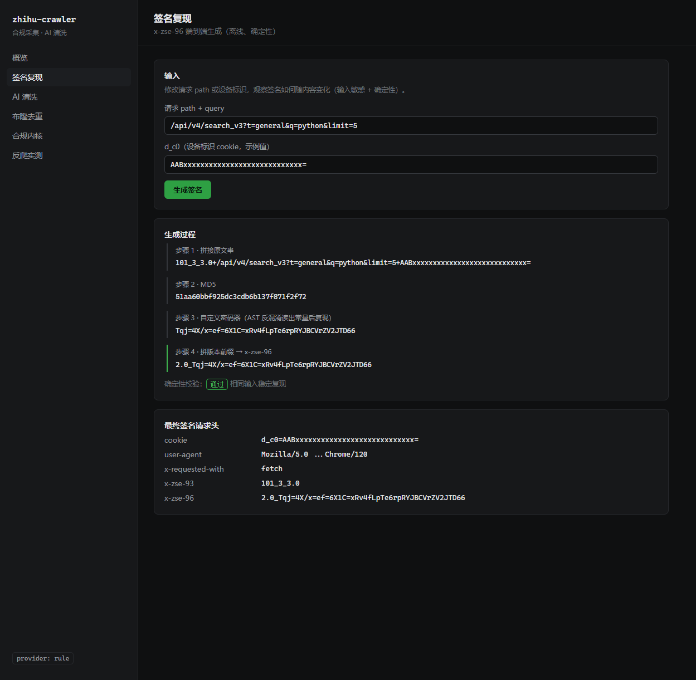
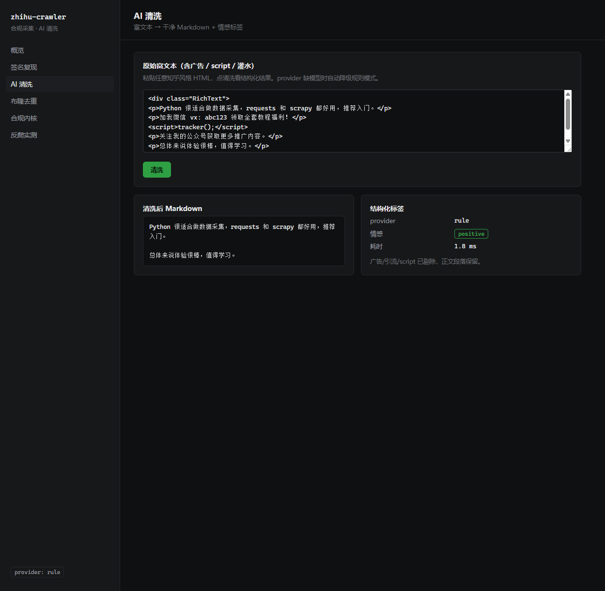
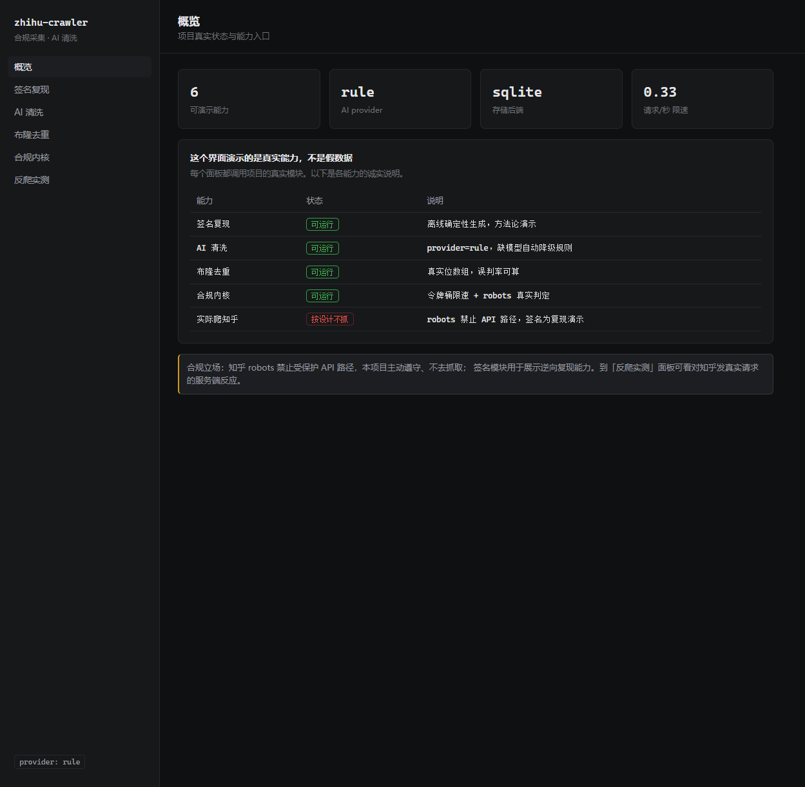

<div align="center">

# 🤖 linuxdo-bot

### linux.do 社区智能监控 · 关键词订阅 · RAG 语义搜索 Telegram 机器人

[]()
[]()
[]()
[]()
[]()

**全站 43 万主题覆盖** · **Cloudflare 反爬突破** · **多出口 IP 轮换** · **RAG 语义检索** · **18,000+ 篇入库**

</div>

---

## ✨ 功能一览

| 功能 | 说明 |
|:---|:---|
| 🔔 **关键词订阅** | 空格 = 且、`\|` = 或、`/正则/`，命中即推送 |
| 👤 **用户关注** | `/subscribe_user` 关注特定用户，TA 发帖即时推送 |
| 🧠 **AI 语义搜索** | `/ask` 用 RAG 检索社区已有方案，带原帖引用链接 |
| ⚡ **一键订阅** | `/quick` inline 按钮：Claude / AI / Gemini / 公益 等热门标签 |
| 🌐 **全站覆盖** | sitemap 枚举 43 万 topic_id → frontier 任务表 → 断点续爬 |
| 🛡️ **CF 反爬突破** | Playwright 真浏览器过 Cloudflare 盾，成功率 95% |
| 🔄 **多 IP 轮换** | 7 个 Clash 出口 IP 按批轮换，分散 CF 频率风控 |
| 📦 **轻量部署** | 极简依赖（requests + numpy），Docker 一键启动 |

---

## 📸 效果展示

<div align="center">

### Telegram Bot 交互



### 全站采集引擎



### 数据采集实况



### 合规限速



### 去重引擎



### 签名复现



### 数据清洗



### 系统总览



</div>

---

## 🚀 快速开始

### 方式一：直接跑（推荐先试）

```bash
# 1. 安装依赖（主力源 = 官方 TG 频道，纯 requests，无需浏览器）
pip install -r requirements.txt

# 2. 【无需 TG token】验证采集与匹配
python -m linuxdo_bot --dry-run --keyword "gpt|ai|模型" --keyword cursor
#   → 从官方 TG 频道拉最新主题，命中的打印到控制台

# 3.（可选）历史回填 + 建 RAG 索引
python -m linuxdo_bot --backfill --pages 20   # 断点续跑，可反复运行
python -m linuxdo_bot --reindex               # 建向量索引
python -m linuxdo_bot --ask "codex 额度超限怎么办"   # 离线自检问答

# 4. 配置 Telegram token 并启动
cp .env.example .env      # 填入从 @BotFather 获取的 TG_BOT_TOKEN
python -m linuxdo_bot     # 在 TG 里对机器人发 /quick 一键订阅
```

### 方式二：Docker（一键）

```bash
cp .env.example .env          # 填 TG_BOT_TOKEN
docker compose up -d          # 轻量 slim 镜像，纯 requests，无需浏览器
```

---

## 🤖 Telegram 命令

| 命令 | 说明 |
|:---|:---|
| `/subscribe 关键词` | 订阅。支持 `python`、`ai\|llm agent`、`/v\d+/`（且/或/正则） |
| `/unsubscribe 关键词` | 取消订阅 |
| `/subscribe_user 用户名` | 关注某用户，TA 发帖就推送 |
| `/unsubscribe_user 用户名` | 取消关注 |
| `/quick` | 一键订阅（inline 按钮：Claude / AI / Gemini / 公益 等） |
| `/ask 问题` | 🧠 AI 搜索社区已有方案（带原帖引用） |
| `/list` | 查看我的订阅 |
| `/latest [n]` | 立即拉最新 n 条 |
| `/help` | 帮助 |

---

## 🏗️ 系统架构

```
  Telegram 用户 ──/subscribe /ask /quick──▶ 命令路由 commands.py
        ▲                                        │
        │ 推送/答案(telegram.py)                   │ 读写订阅
        │                                        ▼
        │                              ┌────────────────────┐
        │                              │  存储 store.py       │
        │                              │  订阅 / 关注 / 去重   │
        │                              └────────────────────┘
        │                                        ▲ 命中?(matcher AND/OR/正则)
  ┌─────┴───────────┐   主题    ┌────────────────┴──────────┐
  │  监控循环         │◀─────────│  官方 TG 频道源             │
  │  monitor.py      │  沉淀    │  t.me/s/linuxdoit(纯requests)│ ← 无 CF 盾
  │  (每 N 分钟)      │─────┐    │  限速 + 退避                │
  └─────────────────┘     │    └───────────────────────────┘
                          ▼
              ┌────────────────────┐      ┌──────────────────────┐
              │  语料库 corpus.py    │◀────▶│  RAG (/ask)           │
              │  documents + 向量    │ 检索 │  embedder+index+engine │
              │  (SQLite, 断点续填)  │      │  三档: 本地/API/TF-IDF  │
              └────────────────────┘      └──────────────────────┘
```

### 数据源

| 数据源 | 协议 | 用途 | Cloudflare |
|:---|:---|:---|:---:|
| `t.me/s/linuxdoit`（官方 TG 频道） | 纯 HTTP | 增量主题发现，主力源 | ❌ 无需 |
| `/t/{id}.json`（Discourse API） | HTTP + Playwright | 全文详情采集 | ✅ 需过盾 |
| `sitemap.xml`（43 子图 × 1 万） | HTTP + Playwright | 全站 topic_id 枚举 | ✅ 需过盾 |

---

## 🔍 /ask 智能搜索（RAG）

论坛原生搜索不好用。`/ask` 用**语义检索 + LLM 综合**帮用户快速找到已有解决方案，**答案始终带原帖引用链接**。

- **数据来源**：监控采集的每条主题都沉淀进语料库（`corpus.py`）；`--backfill` 从 TG 频道 `?before=` 往前翻做历史回填（断点续跑）。
- **三档降级，任何环境可跑**：
  - Embedding：`local`（sentence-transformers 中文语义）→ `api`（OpenAI 兼容）→ `tfidf`（纯 numpy，零依赖回退）
  - 生成：`ollama`（本地）→ `openai`（云）→ `rule`（直接给最相关主题列表）

---

## ⚙️ 配置（.env）

| 变量 | 说明 | 默认 |
|:---|:---|:---|
| `TG_BOT_TOKEN` | **必填**，@BotFather 获取 | — |
| `POLL_INTERVAL` | 采集轮询间隔（秒） | `300` |
| `FETCH_LIMIT` | 每轮取主题数 | `30` |
| `REQUESTS_PER_SECOND` | 限速 | `0.33` |
| `RAG_EMBED_PROVIDER` | 向量化：`tfidf` / `local` / `api` | `tfidf` |
| `RAG_LLM_PROVIDER` | 答案生成：`rule` / `ollama` / `openai` | `rule` |
| `RAG_TOP_K` | 返回相关主题数 | `5` |

完整变量见 [`.env.example`](.env.example)。

---

## 🧩 底层采集引擎

本项目构建在一套通用的**多源采集引擎**之上，核心能力：

- **Cloudflare 反爬突破**：实测 4 种方案递进，最终 Playwright 真浏览器 + reload 重试达 95% 成功率
- **多出口 IP 轮换**：对接 Clash 7 个节点，一个 IP 过盾后连采一批再切换，分散频率风控
- **frontier 任务表**：状态机（`pending → detail_done / gone / failed`），断点续爬零重复零丢失
- **布隆过滤器去重**：1 亿 URL 仅需 ~114MB，较 Redis set 省 70×
- **Scrapy-Redis 分布式**：共享队列 + 断点续爬完整工程
- **AI 清洗管道**：LLM 富文本 → Markdown，剔除广告灌水，三档 provider 降级

```bash
python -m zhihu_crawler.run_multi --source linuxdo,hackernews,arxiv --limit 5
python -m webapp.server     # 可视化演示界面
```

详见 [`docs/architecture.md`](docs/architecture.md)、[`docs/linuxdo-crawling.md`](docs/linuxdo-crawling.md)。

---

## 📌 技术亮点

### 1. Cloudflare 反爬的多级突破

| 方案 | 结果 | 发现 |
|:---|:---|:---|
| requests 直连 | 403 | CF 托管挑战拦截 |
| curl_cffi TLS 指纹伪装 | 仍 403 | 托管挑战需执行 JS，指纹伪装无效 |
| 浏览器内并发 fetch | 403 | CF 按 IP 做突发检测，并发是负优化 |
| **Playwright + reload 重试** | **95% 成功率** | 单 IP 串行 + 过盾失败自动重试 |

### 2. 多出口 IP 轮换策略

发现 CF 按 IP 做频率冷却后，设计**多出口 IP 按批轮换**：对接 Clash API 管理 7 个节点（HK/JP/KR/SG/TW/US/DE），每个 IP 过盾后连采一批，采完切下一个 IP。单 IP 被冷却不影响其他 IP。

### 3. frontier 全站任务表

从 sitemap 枚举 43 万 topic_id 灌入 frontier 表，逐个采集详情并更新状态。已删主题自动标 `gone` 跳过；失败累加 `attempts` 超限标 `failed`。进程重启从 `pending` 继续，**断点续爬零重复零丢失**。

### 4. RAG 三档降级

Embedding 和 LLM 各三档降级：本地 → 云 API → 零依赖回退。没 GPU、没 API key、没联网，`/ask` 仍能跑。跨进程 TF-IDF 维度对齐：检索前检查 `needs_fit()`，用同一份语料重新 fit。

---

## 📂 项目结构

```
linuxdo-bot/
├── README.md
├── requirements.txt
├── .env.example                      # 环境配置模板
├── Dockerfile / docker-compose.yml   # 一键容器部署
├── config.yaml                       # 采集引擎配置
│
├── linuxdo_bot/                      # ⭐ Telegram 机器人应用
│   ├── __main__.py                   # 主入口（--dry-run/--backfill/--reindex/--ask）
│   ├── config.py                     # .env 配置加载
│   ├── monitor.py                    # 监控循环：采集→匹配→分发→沉淀
│   ├── matcher.py                    # 关键词匹配（AND/OR/正则）
│   ├── store.py                      # SQLite 订阅 + 去重
│   ├── corpus.py                     # 语料库 + frontier 任务表
│   ├── sitemap.py                    # sitemap 全站枚举器
│   ├── fullcrawl.py                  # 全站采集调度器
│   ├── backfill.py                   # 历史回填（TG 频道 ?before=）
│   ├── commands.py                   # 命令路由 + inline 回调
│   ├── presets.py                    # 快捷关键词预置
│   ├── telegram.py                   # 轻量 TG API 客户端
│   ├── _bg_crawl.py                  # 后台断点续爬脚本
│   ├── _clash_crawl.py               # Clash 多 IP 轮换爬取
│   └── rag/                          # ⭐ RAG 智能搜索
│       ├── embedder.py               #   向量化：local/api/tfidf 三档
│       ├── index.py                  #   SQLite 向量存储 + numpy 检索
│       ├── retriever.py              #   建索引 / 语义检索
│       └── engine.py                 #   /ask：检索→LLM 综合→带引用
│
├── zhihu_crawler/                    # 通用多源采集引擎
│   ├── sources/                      # 数据源适配器
│   │   ├── tgchannel.py              #   ⭐ 官方 TG 频道（主力，纯 requests）
│   │   ├── linuxdo.py                #   Discourse + Playwright 过盾
│   │   ├── browser_fetcher.py        #   Playwright + 多 IP 代理支持
│   │   ├── hackernews.py             #   Hacker News API
│   │   └── arxiv.py                  #   arXiv API
│   ├── distributed/                  # 分布式基础设施
│   │   ├── dedup.py                  #   布隆过滤器（1 亿 URL ~114MB）
│   │   ├── proxy_pool.py             #   代理池（加权健康分 + 指数退避）
│   │   ├── proxy_fetcher.py          #   代理请求
│   │   └── clash_controller.py       #   Clash API 控制器（IP 轮换）
│   ├── compliance/                   # 合规内核
│   │   ├── robots.py                 #   robots.txt 遵守
│   │   └── throttle.py               #   令牌桶限速 + 退避重试
│   └── ai/                           # AI 清洗
│       ├── cleaner.py                #   LLM 富文本 → Markdown
│       └── providers.py              #   provider 抽象（ollama/api/rule）
│
├── webapp/                           # 可视化演示界面
├── docs/                             # 文档
│   ├── linuxdo-crawling.md           #   linux.do 采集实录
│   ├── architecture.md               #   架构设计
│   ├── rag.md                        #   RAG 设计说明
│   ├── reverse-engineering.md        #   签名逆向方法论
│   └── images/                       #   效果截图
└── tests/                            # 112 项单元测试
```

---

## 📄 License

[MIT](LICENSE)
